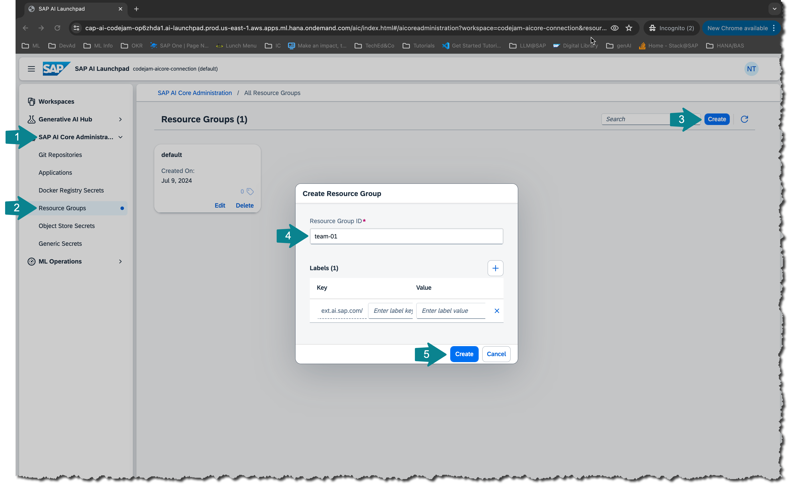
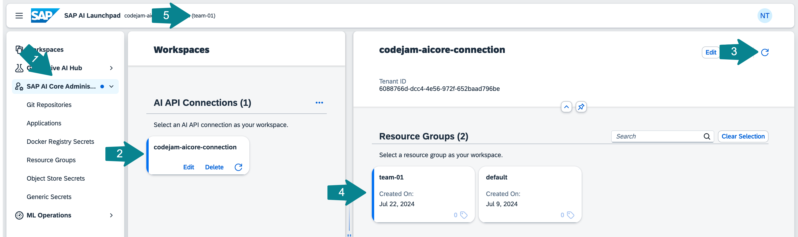

# Setup SAP AI Launchpad and SAP AI Core
SAP AI Launchpad is a multitenant SaaS application on SAP BTP. You can use SAP AI Launchpad to manage AI use cases across different AI runtimes. SAP AI Launchpad also provides generative AI
capabilities via the Generative AI Hub and is available in the Cloud Foundry environment. To access Generative AI Hub you need the **extended plan** of the AI runtime SAP AI Core. You can also connect HANA as an AI runtime or the SAP AI Services, to work with HANA Predictive Analysis Library (PAL) or the SAP AI Service Data Attribute Recommendation.

## [1/4] Open SAP Business Technology Platform
👉 Open your [BTP cockpit](https://emea.cockpit.btp.cloud.sap/cockpit).

👉 Navigate to the subaccount: **generative AI CodeJam**

## [2/4] Open SAP AI Launchpad and connect to SAP AI Core
👉 Go to **Instances and Subscriptions** and check whether you see an SAP AI Core instance and an SAP AI Launchpad subscription.

With SAP AI Launchpad you can administer all your machine learning operations. ☝️ Make sure you have the extended plan of SAP AI Core to leverage Generative AI Hub. To connect SAP AI Core to SAP AI Launchpad you need the SAP AI Core service key.

👉 Open SAP AI Launchpad, in this subaccount the connection is already established. Otherwise you would have to add a new runtime using the SAP AI Core service key information.

## [3/4] Create a new resource group for your team
SAP AI Core tenants use resource groups to isolate AI resources and workloads. Scenarios (e.g. **foundation-models**)
and executables (that is a template to train a model or create a deployment) are shared across all resource groups.

👉 Make sure to create a NEW resource group for your team. DO NOT USE THE DEFAULT RESOURCE GROUP! 

👉 Open the **SAP AI Core Administration** tab and select **Resource Groups**. 

👉 Create a new resource group with your team's name.

👉 Go back to Workspaces.

👉 Select your connection and your resource group.

👉 Make sure it is selected. It should show up at the top next to SAP AI Launchpad.

☝️ You will need the name of your resource group in [Exercise 09-create-connection-configuration](../09-create-connection-configuration/README.md).

