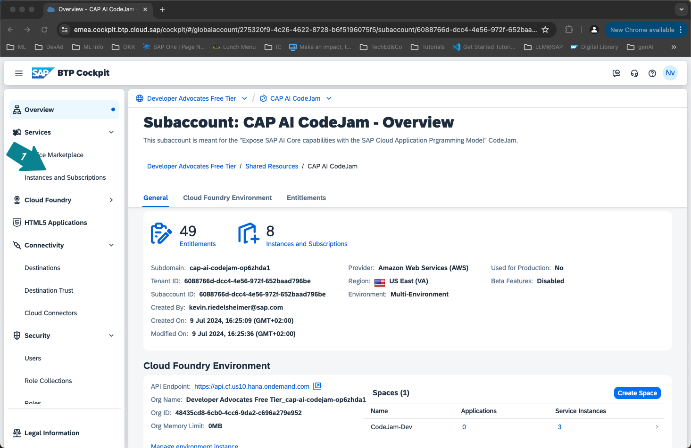
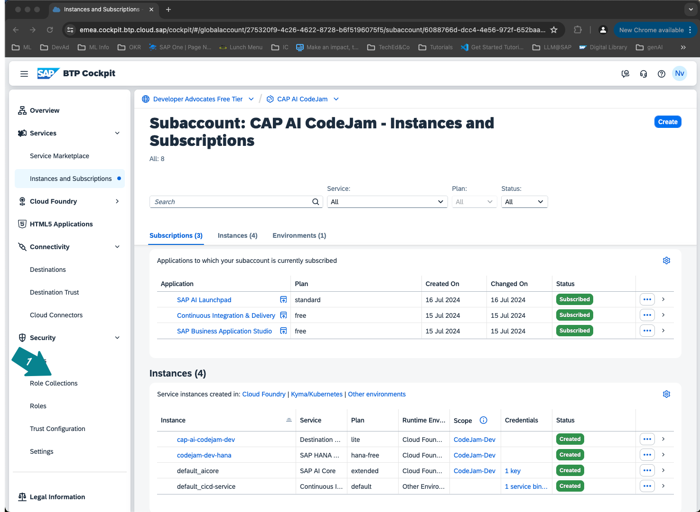
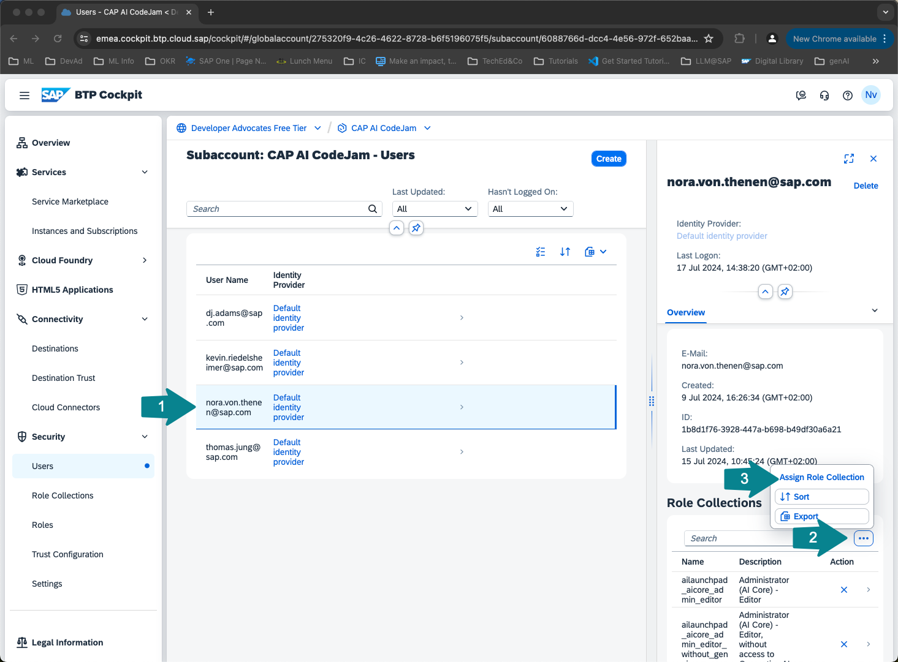
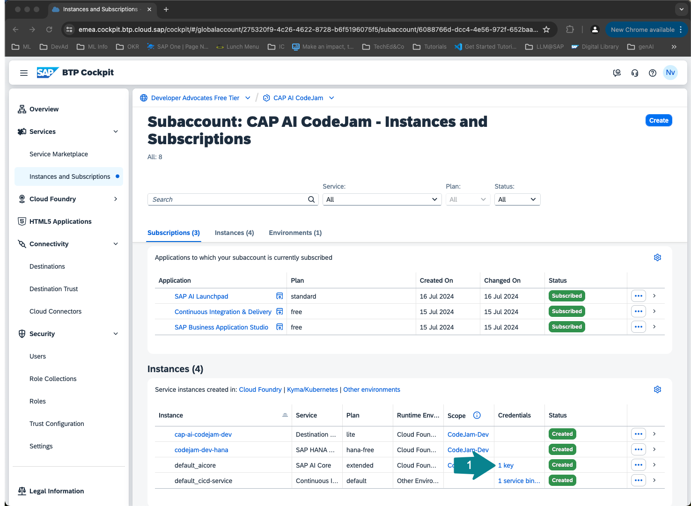
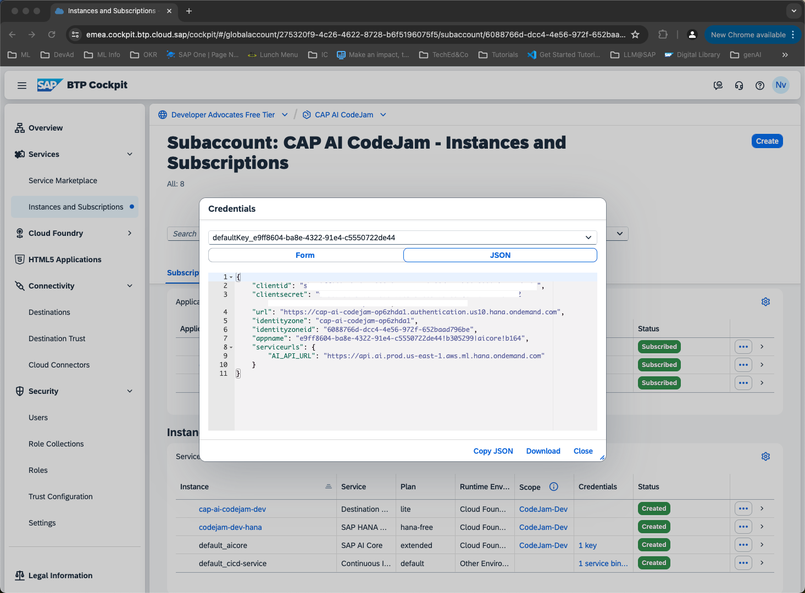

# Setup SAP AI Launchpad and SAP AI Core

## [1/10] Open SAP Business Technology Platform
[BTP cockpit](https://emea.cockpit.btp.cloud.sap/cockpit)

Navigate to the Subaccount: generative AI CodeJam

## [2/10] Open SAP AI Launchpad and connect to SAP AI Core

In Instances and Subscriptions check whether you see an SAP AI Core instance and an SAP AI Launchpad subscription.

👉 Assign all the necessary role collections to your user before using SAP AI Launchpad.

With SAP AI Launchpad you can administer all your machine learning operations. You can connect different AI runtimes, such as SAP AI Core, SAP AI Services or HANA. You can also deploy a proxy for a large laguage or foundation model like GPT-4, Claude, Gemini 1.5 or many more. Make sure you have the extended plan of SAP AI Core to leverage generative AI hub. To connect SAP AI Core to SAP AI Launchpad you need the SAP AI Core service key.

Open SAP AI Launchpad, in this subaccount the connection is already established. Otherwise you would have to add a new runtime using the SAP AI Core service key information.
👉 Make sure to create a new resource group for your team. DO NOT USE THE DEFAULT RESOURCE GROUP!
