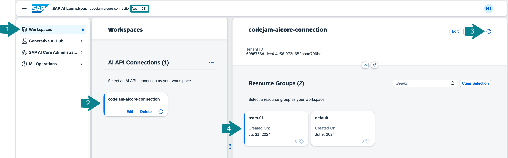

# Setup SAP AI Launchpad and SAP AI Core
[SAP AI Launchpad](https://help.sap.com/docs/ai-launchpad) is a multitenant SaaS application on SAP BTP. You can use SAP AI Launchpad to manage AI use cases across different AI runtimes. SAP AI Launchpad also provides generative AI capabilities via the [Generative AI Hub in SAP AI Core](https://help.sap.com/docs/sap-ai-core/sap-ai-core-service-guide/generative-ai-hub-in-sap-ai-core-7db524ee75e74bf8b50c167951fe34a5). 

You can also connect the SAP HANA database as an AI runtime to work with the HANA Predictive Analysis Library (PAL), or connect SAP AI Services to work with the SAP AI Service Data Attribute Recommendation.

## [1/3] Open SAP Business Technology Platform
👉 Open SAP [BTP Cockpit](https://emea.cockpit.btp.cloud.sap/cockpit).

👉 Navigate to the subaccount: [`GenAI CodeJam`](https://emea.cockpit.btp.cloud.sap/cockpit#/globalaccount/275320f9-4c26-4622-8728-b6f5196075f5/subaccount/a5a420d8-58c6-4820-ab11-90c7145da589/subaccountoverview).

## [2/3] Open SAP AI Launchpad and connect to SAP AI Core
👉 Go to **Instances and Subscriptions**.

Check whether you see an **SAP AI Core** service instance and an **SAP AI Launchpad** application subscription.

With SAP AI Launchpad, you can administer all your machine learning operations. ☝️ You have the `extended` plan of SAP AI Core service instance, so that you can access capabilities of Generative AI Hub.

☝️ In this subaccount the connection between the SAP AI Core service instance and the SAP AI Launchpad application is already established. Otherwise you would have to add a new AI runtime using the SAP AI Core service key information.

Should you need to connect to the SAP AI Core to SAP AI Launchpad, you would need the credentials from the SAP AI Core secret.

👉 Open **SAP AI Launchpad**. Make sure you authenticate your user using the **Default Identity Provider**.

## [3/3] Select the resource group that was assigned to you/your team
SAP AI Core tenants use [resource groups](https://help.sap.com/docs/sap-ai-core/sap-ai-core-service-guide/resource-groups) to isolate AI resources and workloads. Scenarios (e.g. `foundation-models`) and executables (a template for training a model or creation of a deployment) are shared across all resource groups within the instance.

>DO NOT USE THE DEFAULT `default` RESOURCE GROUP!

👉 Go back to **Workspaces**.

👉 Select your workspace (like `codejam-YYY`) and your resource group.

👉 Make sure it is set as a context. The proper name of the context, like `codejam-YYY (team-XX)` should show up at the top next to SAP AI Launchpad.

☝️ You will need the name of your resource group in [Exercise 04-create-embeddings](04-create-embeddings.ipynb).

[Next Exercise](01-explore-genai-hub.md)
