## [1/3] Create a Configuration to Deploy a Proxy for a Large language Model on SAP AI Core

Open the ML Operations tab, go to Scenarios and select the foundation-models scenario. This is the only pre-configered scenario from SAP. For all other custom machine learning models you would need to create your own scenario.

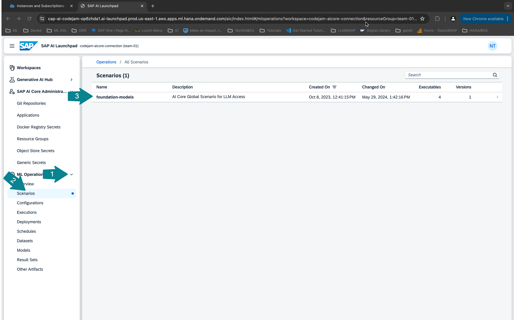

Select the Executables tab and then the serving executable azure-openai to see the available Azure OpenAI models.

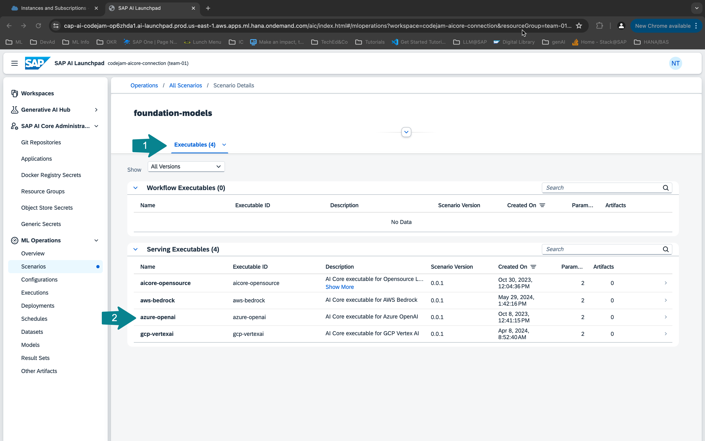

Copy the name of the model you want to deploy the proxy for. In this CodeJam we will use gpt-35-turbo.
After that we will create a configuration.

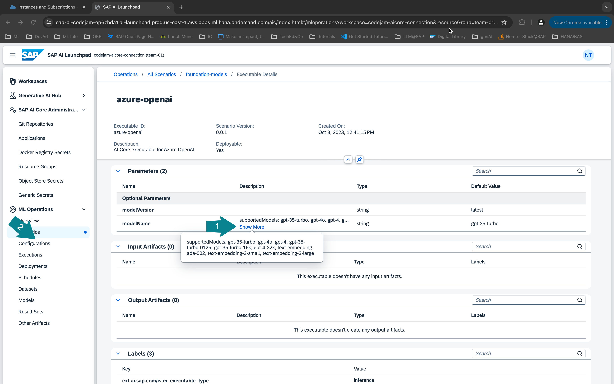

Create a new configuration.

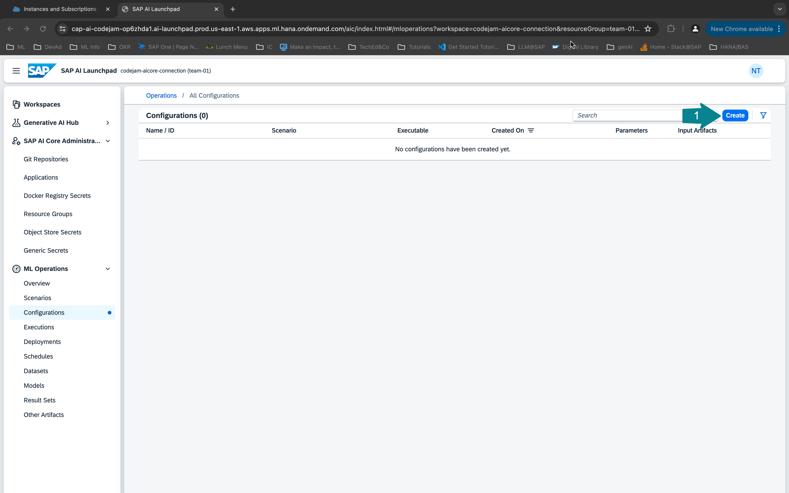

Enter a configuration name of your choice, select the foundation-models scenrario, version and the executable azure-openai. Click next.

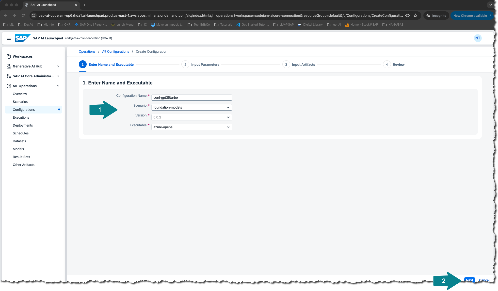

Paste the model name ```sh gpt-35-turbo``` into the modelName field and click next.

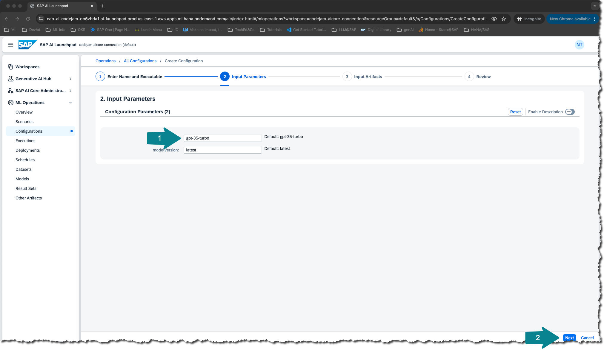

Click Review on the bottom of the page.

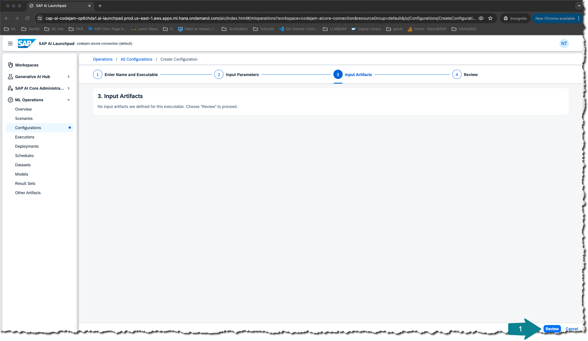

Review the configuration and click create.

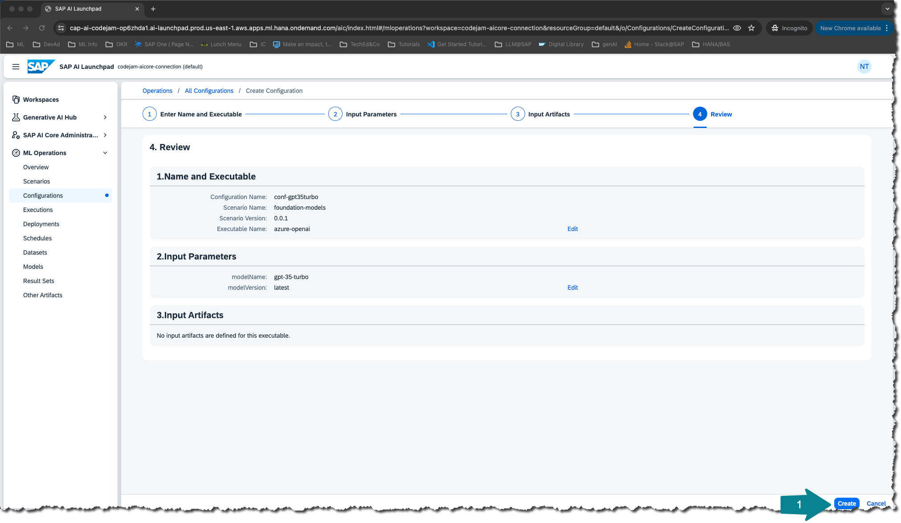

## [2/3] Deploy a Proxy for a Large language Model on SAP AI Core

Click on Create Deployment to create a deployment for that configuration. This will not actually deploy the model but it will deploy a proxy that will return a URL for you to use to query the large language model you specified in the configuration.

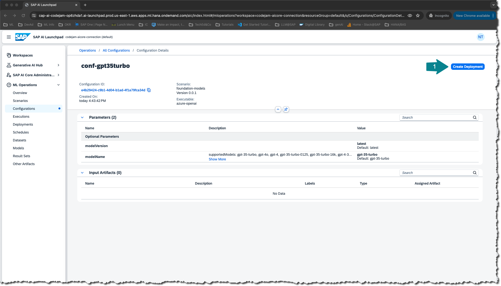

For the duration select Standard. You can also select Custom to have the deployment available for a limited time. Click Review.

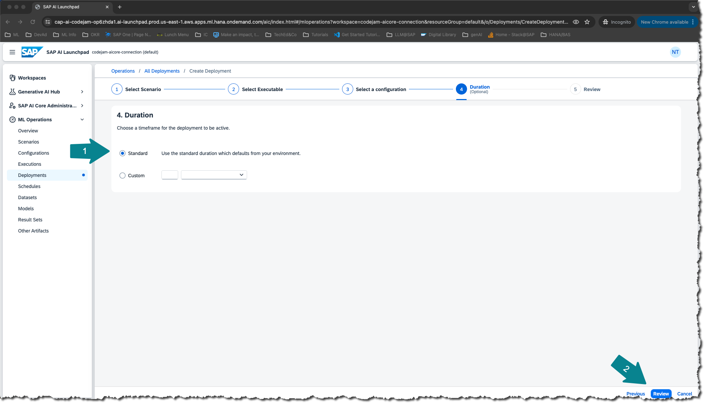

Click Create.

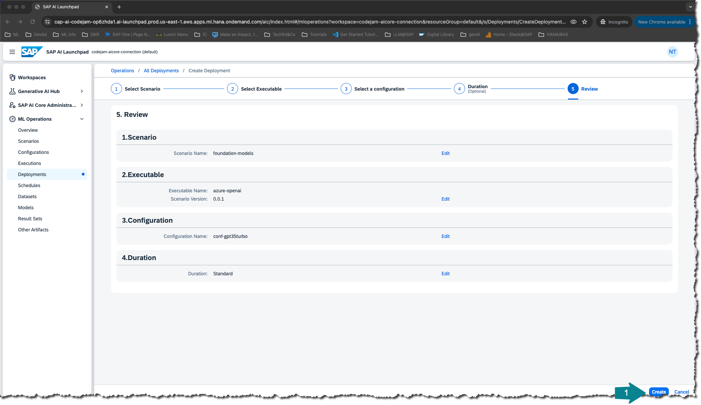

Once the deployment is running you will receive a URL to query the model. Refresh the page until the URL appears. This can take a couple of minutes.

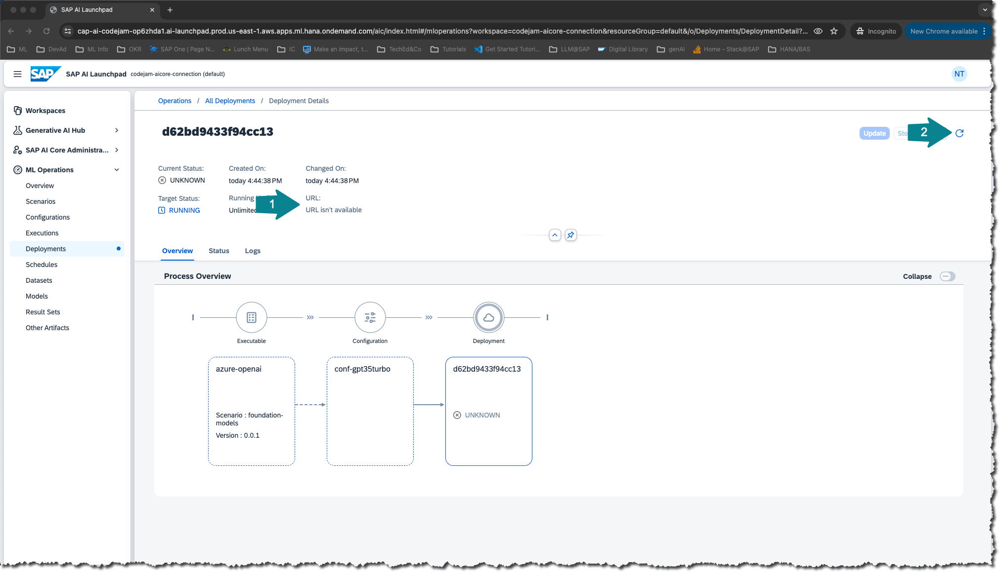

Using the URL and the client id and the client secret from the SAP AI Core service key, you could now already query the model using any programming language or any API platform.

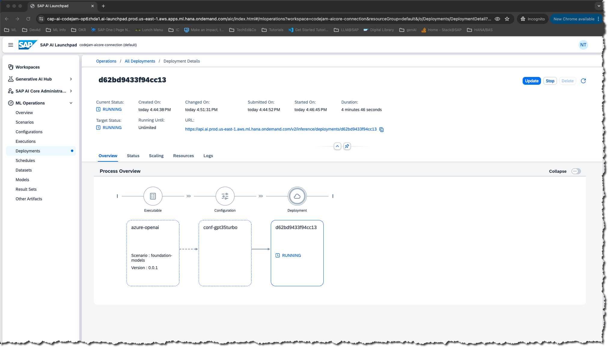

## [3/3] Deploy a Proxy for an Embedding Model on SAP AI Core
To implement a retrieval augmented generation (RAG) use case we also need to deploy an embedding model. The embeddings for our text chunks will then be stored in a vector database (e.g. HANA Vector Store). To deploy the embedding model repeat the steps above using the model name: ```sh text-embedding-ada-002```
