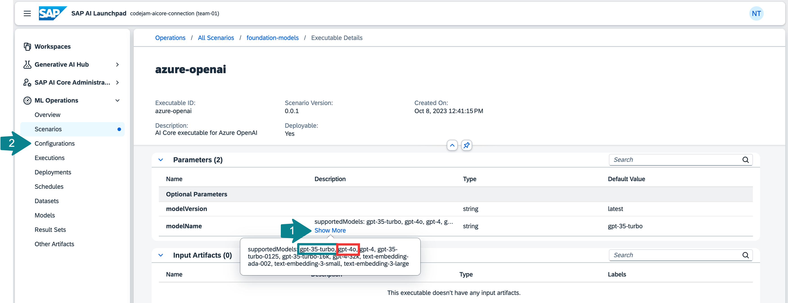
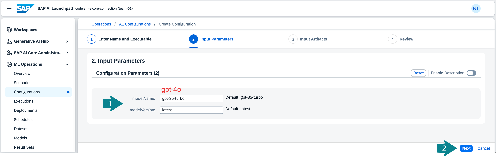
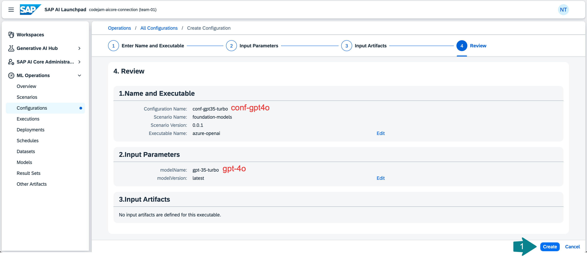
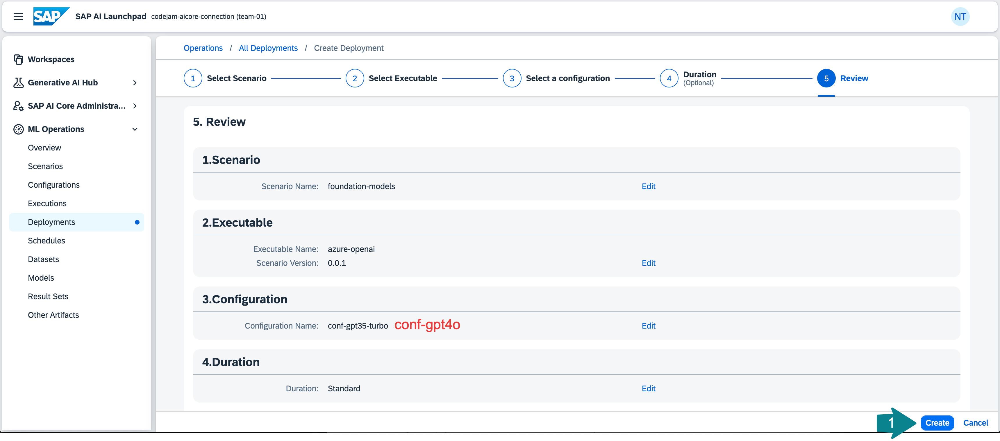

# Deploy a proxy for an LLM on SAP AI Core
With Generative AI Hub on SAP AI Core you have access to all major large language models (LLMs). There are open-source models that SAP has deployed such as the Falcon model. And there are models that SAP is a proxy for, such as the GPT models, Google models, models provided by Amazon Bedrock and more. To use one of the provided LLMs for a custom use case you need to create a deployment configuration of the model. Using the configuration you can then deploy the model. You will then get a deployment URL that is created for you to query the model of your choice.

## Create a configuration to deploy a proxy for a large language model on SAP AI Core

👉 Open the `ML Operations` tab, go to `Scenarios` and select the `foundation-models` scenario. Scenarios related to generative AI are the only pre-configured scenarios provided by SAP. For all other custom machine learning models you would want to train or deploy you will need to create your own scenario.


👉 Select the `Executables` tab and then the `serving executable azure-openai` to see the available Azure OpenAI models.


👉 **Copy** the name of the model you want to deploy the proxy for. 

For this CodeJam you will use `gpt-35-turbo`.
After that you will create a configuration.

👉 Click on `Configurations`.



👉 **Create** a new configuration.


👉 Enter a configuration e.g. *conf-gpt35-turbo*, select the `foundation-models` scenario, version and the executable `azure-openai`. Click **Next**.


👉 Paste the model name `gpt-35-turbo` into the `modelName` field and click **Next**.

```
gpt-35-turbo
```



👉 Click **Review** on the bottom of the page.


👉 Review the configuration and click **Create**.



## Deploy a proxy for a large language model on SAP AI Core

👉 Click on `Create Deployment` to create a deployment for that configuration. This will not actually deploy the model but it will deploy a proxy that will return a URL for you to use to query the LLM you specified in the configuration.


👉 For the duration select `Standard`. 

You can also select `Custom` to have the deployment available for a limited time. 

👉 Click **Review**.


👉 Click **Create**.



The deployment status is going to change from UNKNOWN to PENDING and then to RUNNING. Once the deployment is running you will receive a URL to query the model. Wait a couple of minutes, then **refresh** the page for the URL to appear. 


Using the `URL`, the `client id` and the `client secret` from the SAP AI Core service key, you could now already query the model using any programming language or any API platform.

☝️ You will need the deployment ID of this model and of the embedding model you will deploy in the next step in [Exercise 04-prompt-llm](04-prompt-llm.ipynb) and in [Exercise 05-create-embeddings](05-create-embeddings.ipynb).


## Deploy a proxy for an embedding model on SAP AI Core
👉 To implement a retrieval augmented generation (RAG) use case we also need to deploy an embedding model. The embeddings for our text chunks will then be stored in a vector database (e.g. [SAP HANA Cloud Vector Engine](https://help.sap.com/docs/hana-cloud-database/sap-hana-cloud-sap-hana-database-vector-engine-guide/sap-hana-cloud-sap-hana-database-vector-engine-guide)). To deploy the embedding model repeat the steps above using the model name `text-embedding-ada-002` instead of `gpt-35-turbo`: 
```
text-embedding-ada-002
```
## Summary

At this point, you will have learned which models are available via Generative AI Hub and how to deploy LLMs in SAP AI Launchpad.

## Further reading

* [SAP AI Launchpad - Help Portal (Documentation)](https://help.sap.com/docs/ai-launchpad/sap-ai-launchpad/what-is-sap-ai-launchpad)
* [SAP AI Core Terminology](https://help.sap.com/docs/sap-ai-core/sap-ai-core-service-guide/terminology)
* [Available Models in the Generative AI Hub](https://help.sap.com/docs/sap-ai-core/sap-ai-core-service-guide/models-and-scenarios-in-generative-ai-hub)

---

[Next exercise](02-explore-genai-hub.md)
