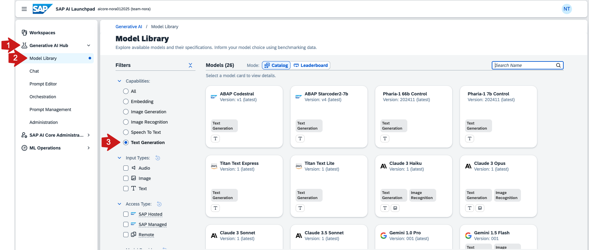
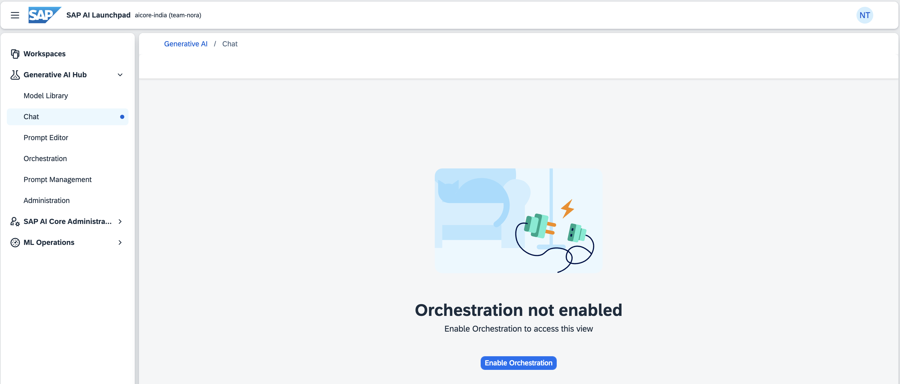
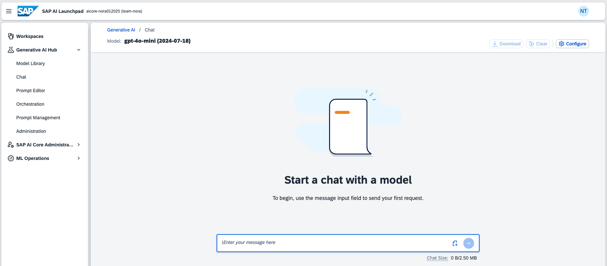

# Explore Generative AI Hub in SAP AI Launchpad

To leverage large language models (LLMs) or foundation models in your applications, you can use the Generative AI Hub on SAP AI Core. Like most other LLM applications, Generative AI Hub operates on a pay-per-use basis.

Generative AI Hub offers all major models on the market. There are open-source models that SAP has deployed such as the Falcon model. And there are models that SAP is a proxy for, such as the GPT models, Google models, models provided by Amazon Bedrock and more. You can easily switch between them, compare results, and select the model that works best for your use case.

SAP maintains strict data privacy contracts with LLM providers to ensure that your data remains secure.

To start using one of the available models in Generative AI Hub, you need to first deploy it. You can either deploy an orchestration service and then have all available models accessible through that. Or you can deploy a single model directly via the **Model Library**. You can access your deployed models using the Python SDK, the SAP Cloud SDK for AI (JavaScript SDK), any programming language or API platform, or the user interface in SAP AI Launchpad. The SAP AI Launchpad offers a **Model Library**, a **Chat** interface and a **Prompt Editor**, where you can also save prompts and the model's responses.

## Deploy a proxy via the Model Library



👉 Open the `Generative AI Hub` tab and select `Model Library`. 

👉 Click on **GPT-4o Mini** which is a text generation model that can also process images.


👉 Click on `Deploy` **ONE TIME** to make the model endpoint available to you. **It will TAKE A MINUTE to be deployed.**


👉 Click on `Use in Chat` to open the chat interface and start interacting with the model.

> ☝️ If your model is not deployed yet, the Chat window will ask you to enable the orchestration service. You can do that and then you have all the models available to chat to. If you deploy the orchestration service now, you will not have to do it again in exercise [07-deploy-orchestration-service.md](07-deploy-orchestration-service.md)


If your model is deployed, the chat will look like this:


## Use the Chat in Generative AI Hub

👉 If you lost the previous chat window you can always open the `Generative AI Hub` tab and select `Chat`.

👉 Click `Configure` and have a look at the available fields. 

Under `Selected Model` you will find all the deployed models. If there is no deployment this will be empty and you will not be able to chat. If you have more than one large language model deployed you will be able to select which one you want to use here. 

The `Frequency Penalty` parameter allows you to penalize words that appear too frequently in the text, helping the model sound less robotic.

Similarly, the higher the `Presence Penalty`, the more likely the model is to introduce new topics, as it penalizes words that have already appeared in the text.

The `Max Tokens` parameter allows you to set the size of the model's input and output. Tokens are not individual words but are typically 4-5 characters long.

The `Temperature` parameter allows you to control how creative the model should be, determining how flexible it is in selecting the next token in the sequence.


In the `Chat Context` tab, right under `Context History`, you can set the number of messages to be sent to the model, determining how much of the chat history should be provided as context for each new request. This is basically the size of the models memory.

You can also add a `System Message` to describe the role or give more information about what is expected from the model. Additionally, you can provide example inputs and outputs.


## Prompt Engineering
👉 Try out different prompt engineering techniques following these examples:

1. **Zero shot**:
   ```
    The capital of the U.S. is:
    ``` 
2. **Few shot**:
    ```
    Germany - Berlin
    India - New Delhi
    France - 
    ```
3. **Chain of thought**:
    ```
    1. What is the most important city of a country?
    2. In which country was the hot air balloon originally developed?
    3. What is the >fill in the word from step 1< of the country >fill in the word from step 2<.
    ```

👉 Try to add something funny to the `System Message` like "always respond like a pirate" and try the prompts again. You can also instruct it to speak more technically, like a developer, or more polished, like in marketing.

👉 Have the model count letters in words. For example how often the letter **r** occurs in **strawberry**. Can you come up with a prompt that counts it correctly?

> 👉 Before you move on to the next exercise, make sure to also deploy the `Text Embedding 3 Small` model. You will need it later! Clicking the deploy button once is enough, then you can see your deployments under `ML Operations>Deployments`.

## Use the Prompt Editor in Generative AI Hub
The `Prompt Editor` is useful if you want to save a prompt and its response to revisit later or compare prompts. Often, you can identify tasks that an LLM can help you with on a regular basis. In that case, you can also save different versions of the prompt that work well, saving you from having to write the prompt again each time. 

The parameters you were able to set in the `Chat` can also be set here. Additionally, you can view the number of tokens your prompt used below the response.

👉 Go over to `Prompt Editor`, select a model and set `Max Tokens` to the maximum again

👉 Paste the example below and click **Run** to try out the example below. 

👉 Give your prompt a `Name`, a `Collection` name, and **Save** the prompt.

👉 If you now head over to `Prompt Management` you will find your previously saved prompt there. To run the prompt again click `Open in Prompt Editor`. You can also select other saved prompts by clicking on **Select**.

1. Chain of thought prompt - customer support:
    ```
    You are working at a big tech company and you are part of the support team.
    You are tasked with sorting the incoming support requests into: German, English, Polish or French.
    
    Review the incoming query.  
    Identify the language of the query as either German, English, Polish, or French.  
    - Example: 'bad usability. very confusing user interface.' - English  
    Count the number of queries for each language: German, English, Polish, and French.  
    Summarize the key pain points mentioned in the queries in bullet points in English.  

    Queries:
    - What are the shipping costs to Australia?
    - Kann ich einen Artikel ohne Kassenbon umtauschen?
    - Offrez-vous des réductions pour les achats en gros?
    - Can I change the delivery address after placing the order?
    - Comment puis-je annuler mon abonnement?
    - Wo kann ich den Status meiner Reparatur einsehen?
    - What payment methods do you accept?
    - Czemu to tak długo ma iść do Wrocławia, gdy cena nie jest wcale niska?
    - Quel est le délai de livraison estimé pour le Mexique?
    - Gibt es eine Garantie auf elektronische Geräte?
    - I’m having trouble logging into my account, what should I do?
    ```


👉 If you still have time. Ask the LLM to come up with different support queries to have more data.

👉 Or in case you are already bored, you could help me come up with a cool scavenger hunt for my sons birthday in a couple of weeks. He likes pirates and dinosaurs. Maybe you and the model of your choice can help me come up with clues and small tasks a bunch of five year olds can do?

## Summary

By this point, you will know how to use the Generative AI Hub user interface in SAP AI Launchpad to query LLMs and store important prompts. You will also understand how to refine the output of a large language model using prompt engineering techniques.

## Further reading

* [Generative AI Hub on SAP AI Core - Help Portal (Documentation)](https://help.sap.com/docs/sap-ai-core/sap-ai-core-service-guide/generative-ai-hub-in-sap-ai-core-7db524ee75e74bf8b50c167951fe34a5)
* [This](https://www.promptingguide.ai/) is a good resource if you want to know more about prompt engineering.
* [This](https://developers.sap.com/tutorials/ai-core-generative-ai.html) is a good tutorial on how to prompt LLMs with Generative AI Hub.

---

[Next exercise](02-setup-python-environment.md)
