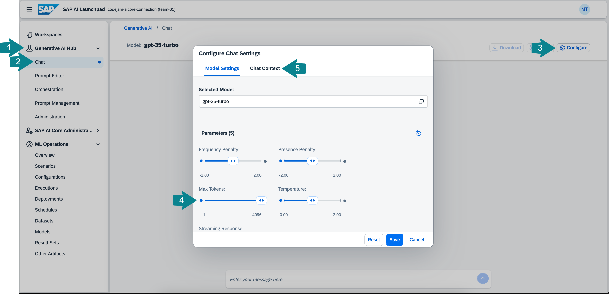
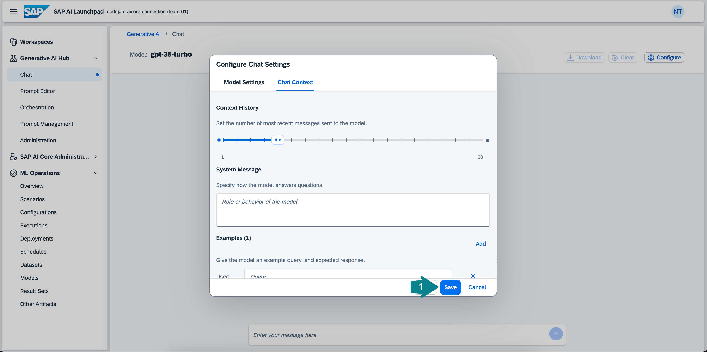
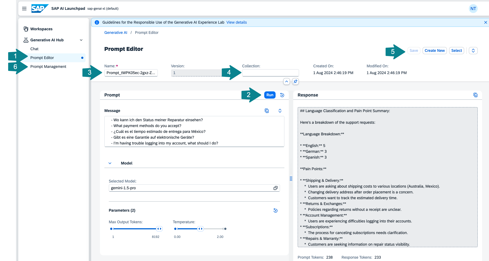

# Explore Generative AI Hub in SAP AI Launchpad

To leverage large language models (LLMs) or foundation models in your applications, you can use the Generative AI Hub on SAP AI Core. Like most other LLM applications, Generative AI Hub operates on a pay-per-use basis.

Generative AI Hub offers all major models on the market. You can easily switch between them, compare results, and select the model that works best for your use case.

SAP maintains strict data privacy contracts with LLM providers to ensure that your data remains secure.

You can access your deployed models using the Python SDK, the cap-llm-plugin, any programming language or API platform, or the user interface in SAP AI Launchpad. The SAP AI Launchpad offers a **Chat** interface and a **Prompt Editor**, where you can also save prompts and the model's responses.

## Use the Chat in Generative AI Hub

👉 Open the `Generative AI Hub` tab and select `Chat`. 

👉 Click `Configure` and have a look at the available fields. 

Under `Selected Model` you will find all the deployed models. If there is no deployment this will be empty and you will not be able to chat. If you have more than one large language model deployed you will be able to select which one you want to use here. 

The `Frequency Penalty` parameter allows you to penalize words that appear too frequently in the text, helping the model sound less robotic.

Similarly, the higher the `Presence Penalty`, the more likely the model is to introduce new topics, as it penalizes words that have already appeared in the text.

The `Max Tokens` parameter allows you to set the size of the model's input and output. Tokens are not individual words but are typically 4-5 characters long.

The `Temperature` parameter allows you to control how creative the model should be, determining how flexible it is in selecting the next token in the sequence.

👉 Increase `Max Tokens` to the maximum amount by sliding the bar all the way to the right.



In the `Chat Context` tab, right under `Context History`, you can set the number of messages to be sent to the model, determining how much of the chat history should be provided as context for each new request.

You can also add a `System Message` to describe the role or give more information about what is expected from the model. Additionally, you can provide example inputs and outputs.



## Prompt Engineering
👉 Try out different prompt engineering techniques following these examples:

1. **Zero shot**:
   ```
    The capital of the U.S. is:
    ``` 
2. **Few shot**:
    ```
    Germany - Berlin
    India - New Delhi
    Poland - 
    ```
3. **Chain of thought**:
    ```
    1. What is the most important city of a country?
    2. In which country was the Internet originally developed?
    3. What is the >fill in the word from step 1< of the country >fill in the word from step 2<.
    ```

👉 Try to add something funny to the `System Message` like "always respond like a pirate" and try the prompts again. You can also instruct it to speak more technically, like a developer, or more polished, like in marketing.

## Use the Prompt Editor in Generative AI Hub
The `Prompt Editor` is useful if you want to save a prompt and its response to revisit later or compare prompts. Often, you can identify tasks that an LLM can help you with on a regular basis. In that case, you can also save different versions of the prompt that work well, saving you from having to write the prompt again each time. 

The parameters you were able to set in the `Chat` can also be set here. Additionally, you can view the number of tokens your prompt used below the response.

👉 Go over to `Prompt Editor`, select a model and set `Max Tokens` to the maximum again

👉 Paste the example below and click **Run** to try out the example below. 

👉 Give your prompt a `Name`, a `Collection` name, and `Save` the prompt.

👉 If you now head over to `Prompt Management` you will find your previously saved prompt there. To run the prompt again click `Open in Prompt Editor`. You can also select other saved prompts by clicking on `Select`.

1. Chain of thought prompt - customer support:
    ```
    You are working at a big tech company and you are part of the support team.
    You are tasked with sorting the incoming support requests into: German, English, Polish or Spanish.

    Read the incoming query.
    Then classify the language of the query into German, English, Polish or Spanish.
    Examples: 'bad usability. very confusing user interface.' - English
    Then count how many German, English, Polish or Spanish queries there are
    Then using English summarize in bullet points the most important pain points in the queries.

    Queries:
    - What are the shipping costs to Australia?
    - Kann ich einen Artikel ohne Kassenbon umtauschen?
    - ¿Ofrecen descuentos para compras al por mayor?
    - Can I change the delivery address after placing the order?
    - ¿Cómo puedo cancelar mi suscripción?
    - Wo kann ich den Status meiner Reparatur einsehen?
    - What payment methods do you accept?
    - Czemu to tak długo ma iść do Wrocławia, gdy cena nie jest wcale niska?
    - ¿Cuál es el tiempo estimado de entrega para México?
    - Gibt es eine Garantie auf elektronische Geräte?
    - I’m having trouble logging into my account, what should I do?
    ```



👉 If you still have time. Ask the LLM to come up with different support queries to have more data.

## Summary

By this point, you will know how to use the Generative AI Hub user interface in SAP AI Launchpad to query LLMs and store important prompts. You will also understand how to refine the output of a large language model using prompt engineering techniques.

## Further reading

* [Generative AI Hub on SAP AI Core - Help Portal (Documentation)](https://help.sap.com/docs/sap-ai-core/sap-ai-core-service-guide/generative-ai-hub-in-sap-ai-core-7db524ee75e74bf8b50c167951fe34a5)
* [This](https://www.promptingguide.ai/) is a good resource if you want to know more about prompt engineering.
* [This](https://developers.sap.com/tutorials/ai-core-generative-ai.html) is a good tutorial on how to prompt LLMs with Generative AI Hub.

---

[Next exercise](03-setup-python-environment.md)
