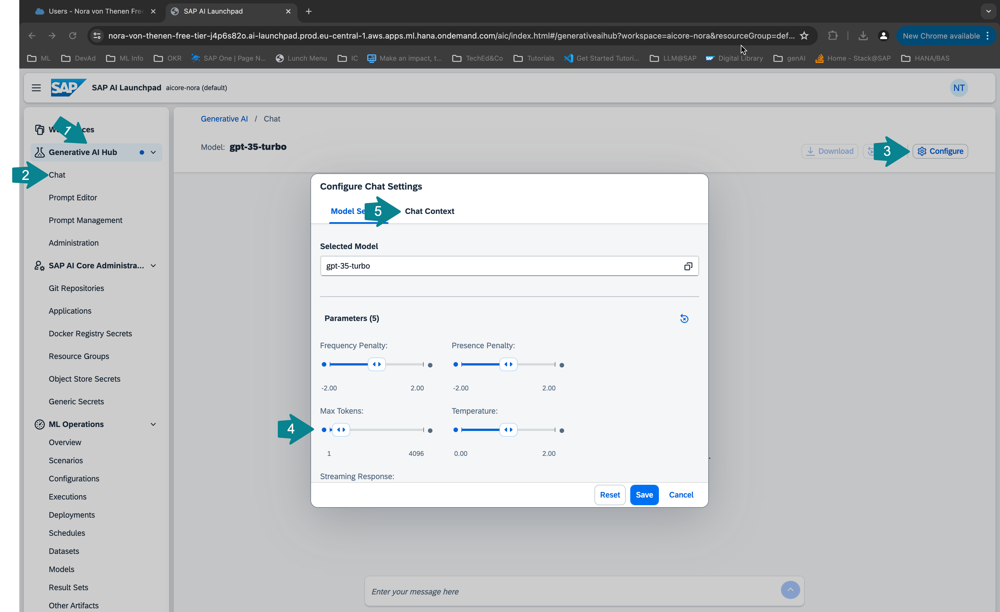
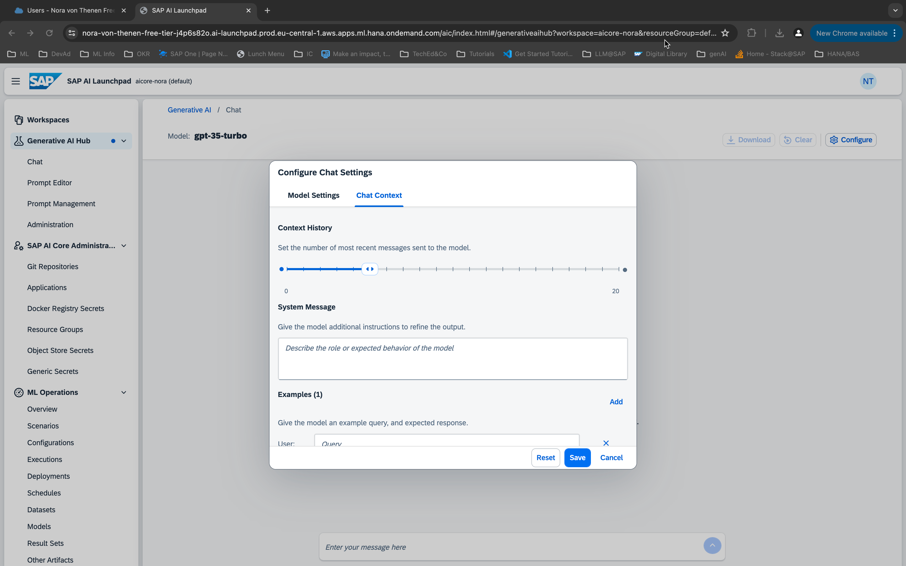
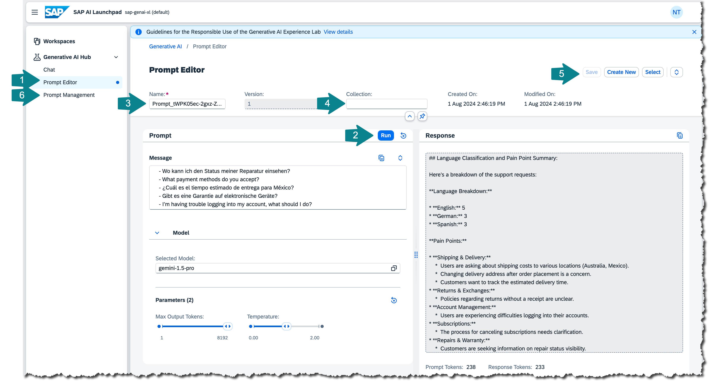

# Exercise 03 - Explore Generative AI Hub in SAP AI Launchpad

In order to leverage large language models (LLMs) or foundation models in your applications you can use Generative AI Hub on SAP AI Core. Like most other LLM applications Generative AI Hub is pay-per-use. Generative AI Hub offers all major models on the market and will offer in total 22 foundation models until Q4. You can switch between them and compare results and pick the model for your use case that works best. SAP has strict data privacy contracts with LLM providers to ensure that your data is safe.

You can access your deployed models either using the Python SDK, the cap-llm-plugin, any programming language or API platform OR you can use the user interface in SAP AI Launchpad. We offer the **Chat** interface or the **Prompt Editor** where you can also save prompts and responses or prompt templates. At SAP, every employee can access the SAP AI Launchpad and query all of the available models.

## Use the Chat in Generative AI Hub

👉 Open the **Generative AI Hub** tab and select **Chat**. Now click **Configure** and have a look at the available fields. 

Under **Selected Model** you will find all the deployed models. If there is no deployment this will be empty and you will not be able to chat. If you have more than one large language model deployed you will be able to select which one you want to use here. 

The parameter **Frequency Penalty** allows you to penalize words that appear too frequently in the text, leading to the model not sounding too robotic. Similarly the higher the **Presence Penalty**, the more likely the model will talk about new topics, as you penalize words that have appeared in the text so far. With **Max Tokens** you can set the size of the input and output of the model. Where tokens are not words but rather 4-5 characters long. With the **Temperature** parameter you can set how creative the model should sound so flexible the model is allowed to be in selecting the next token in the sequence.



In the **Chat Context** tab right under **Context History** you can set the number of messages that should be send to the model. So how much of the chat history should be provided as context to the model for each new request. You can add a **System Message** to describe the role or give more information of what is expected from the model. You can also provide example inputs and outputs.



## Prompt Engineering
👉 Try out different prompt engineering techniques following these examples:

1. Zero shot:
   ```
    The capital of the U.S. is:
    ``` 
2. Few shot:
    ```
    Germany - Berlin
    France - Paris
    U.S. - 
    ```
3. Chain of thought:
    ```
    1. What is the most important city of a country?
    2. In which country was the Internet originally developed?
    3. What is the >fill in the word from step 1< of the country >fill in the word from step 2<.
    ```

👉 Try to add something funny to the **System Message** like "always respond like a pirate" and try the prompts again. You can also ask it to speak more technical like a developer or rather shiny like Marketing.

## Use the Prompt Editor in Generative AI Hub
The **Prompt Editor** is useful if you want to store a prompt and the response to come back to it later or use it as a prompt template. Often you can identify tasks that an LLM can help you with on a regular basis. In that case you cn also save different versions of the prompt that works well and you do not need to write the prompt again every time. The parameters you were able to set in the **Chat** you can also set here. You can also see the number of tokens your prompt used below the response.

👉 Go over to **Prompt Editor**, select a model and click **run** to try out the example below. 

👉 Give your prompt a **Name** and a **Collection** name and **Save** the prompt.

👉 If you now head over to **Prompt Management** you will find your previously saved prompt there. To run the prompt again click **Open in Prompt Editor**. You can also select other saved prompts by clicking on **Select**.

1. Chain of thought prompt - customer support:
    ```
    You are working at a big tech company and you are part of the support team.
    You are tasked with sorting the incoming support requests into: German, English or Spanish.
    
    Read the incoming query
    Then classify the language of the query into German, English or Spanish
    Examples: 'bad usability. very confusing user interface.' - English
    Then count how many German, English or Spanish queries there are
    Then summarize in bullet points the most important pain points in the queries.

    Queries:
    - What are the shipping costs to Australia?
    - Kann ich einen Artikel ohne Kassenbon umtauschen?
    - ¿Ofrecen descuentos para compras al por mayor?
    - Can I change the delivery address after placing the order?
    - ¿Cómo puedo cancelar mi suscripción?
    - Wo kann ich den Status meiner Reparatur einsehen?
    - What payment methods do you accept?
    - ¿Cuál es el tiempo estimado de entrega para México?
    - Gibt es eine Garantie auf elektronische Geräte?
    - I’m having trouble logging into my account, what should I do?
    ```



👉 If you still have time. Ask the llm to come up with different support queries to have more data.

## Summary

At this point, you will know how to use the user interface of Generative AI Hub in SAP AI Launchpad to query LLMs and store important prompts. You also know how to tweak the output of a large language model by applying prompt engineering techniques.

## Further reading

* [Generative AI Hub on SAP AI Core - Help Portal (Documentation)](https://help.sap.com/docs/sap-ai-core/sap-ai-core-service-guide/generative-ai-hub-in-sap-ai-core-7db524ee75e74bf8b50c167951fe34a5)
* [This](https://www.promptingguide.ai/) is a good recourse if you want to know more about prompt engineering.
* [This](https://developers.sap.com/tutorials/ai-core-generative-ai.html) is a good tutorial on how to prompt LLMs with Generative AI Hub.

---

[Next exercise](../04-explore-sap-hana-cloud-vector-engine/README.md)
