# Setup SAP Business Application Studio and a dev space

[SAP Business Application Studio](https://help.sap.com/docs/bas/sap-business-application-studio/what-is-sap-business-application-studio) is based on Code-OSS, an open-source project used for building Visual Studio Code. Available as a cloud service, SAP Business Application Studio provides a desktop-like experience similar to leading IDEs, with command line and optimized editors.

At the heart of SAP Business Application Studio (BAS) are dev spaces. Dev spaces are comparable to isolated virtual machines in the cloud containing tailored tools and pre-installed runtimes per business scenario, such as SAP Fiori, SAP S/4HANA extensions, Workflow, HANA native development and more. This simplifies and speeds up the setup of your development environment, enabling you to efficiently develop, test, build, and run your solutions locally or in the cloud.

## Open SAP Business Application Studio

👉 Go back to the [BTP cockpit](https://emea.cockpit.btp.cloud.sap/cockpit#/globalaccount/275320f9-4c26-4622-8728-b6f5196075f5/subaccount/a5a420d8-58c6-4820-ab11-90c7145da589/subaccountoverview).

👉 Navigate to `Instances and Subscriptions` and open `SAP Business Application Studio`.

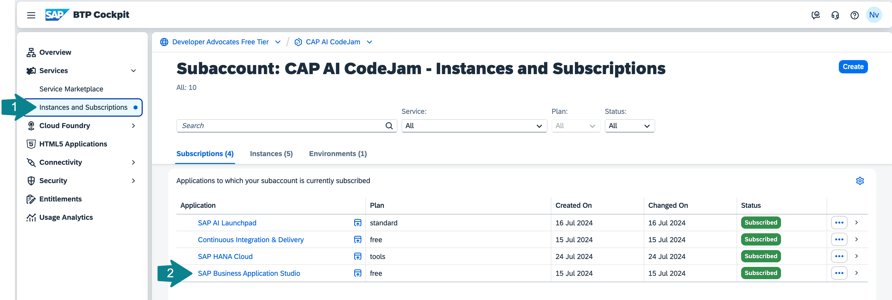

👉 Make sure you authenticate using the **IAS Identity Provider (a7rg4vxjp)**.

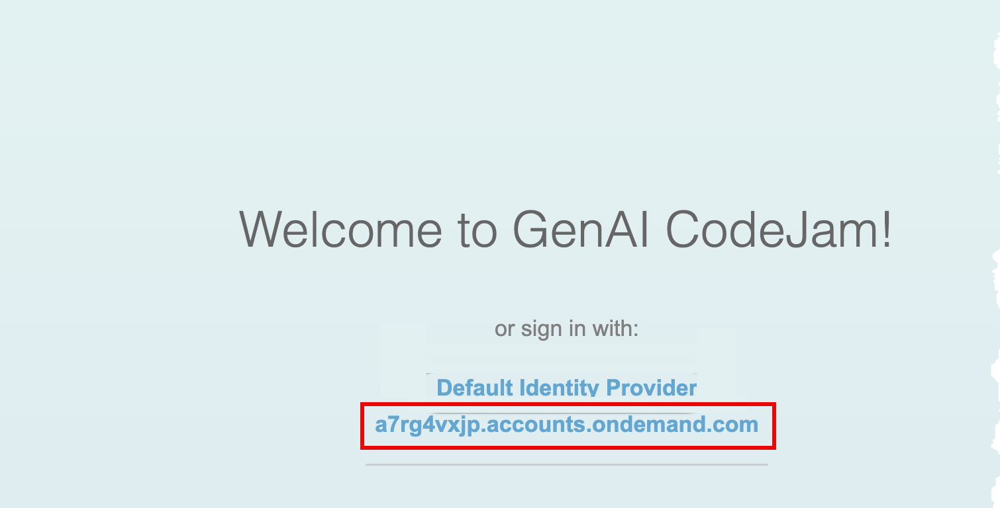

## Create a new Dev Space for CodeJam exercises

👉 Create a new Dev Space.

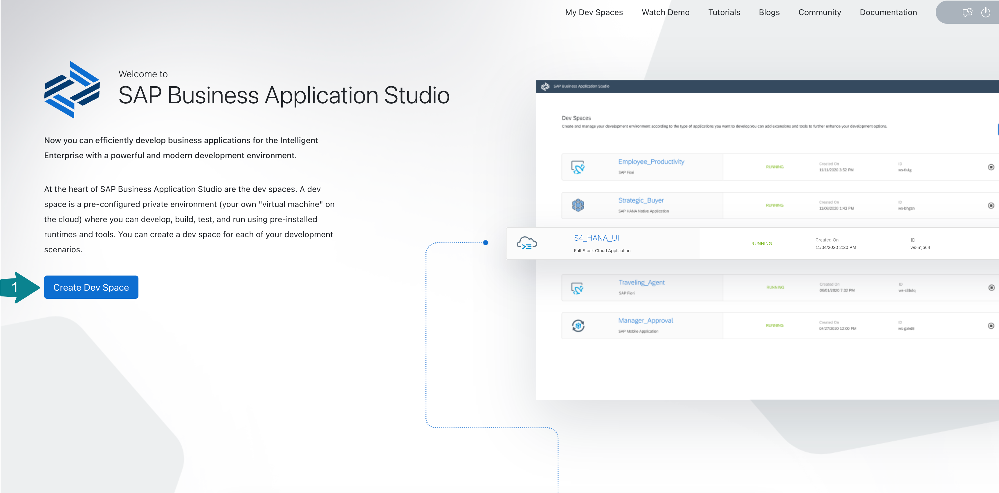

👉 Enter a name for a dev space, select the option for `Basic` application and make sure to select `Python Tools` from Additional SAP Extensions.

👉 Click **Create Dev Space**.

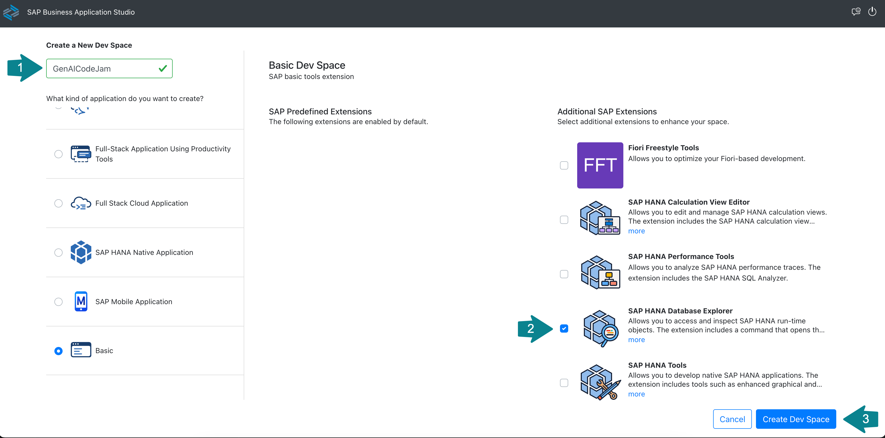

You should see the dev space **STARTING**.

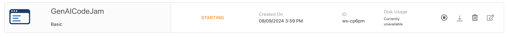

👉 Wait for the dev space to transition into the **RUNNING** state and then open it.

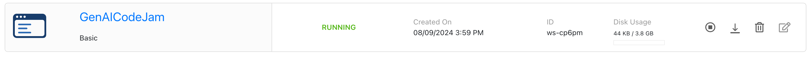

## Clone the exercises from the Git repository

👉 Once you opened your dev space in BAS, use one of the available options to clone this Git repository into your dev space:

```sh
https://github.com/SAP-samples/generative-ai-codejam.git
```

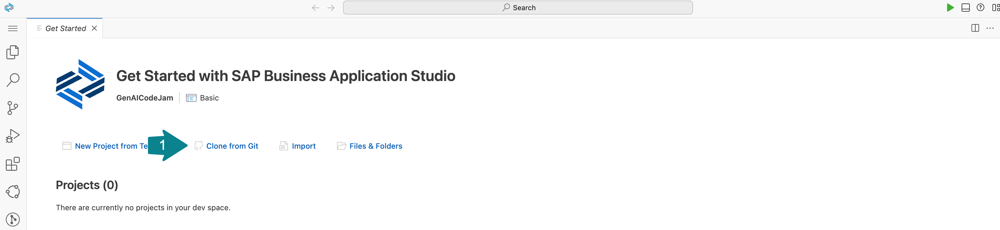

👉 Click **Open** to open a project in the Explorer view.

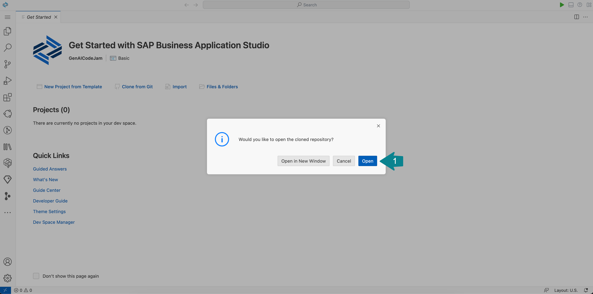

## Open the Workspace

The cloned repository contains a file `codejam.code-workspace` and therefore you will be asked, if you want to open it.

👉 Click **Open Workspace**.

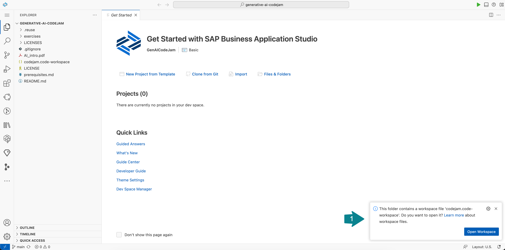

☝️ If you missed the previous dialog, you can go to the BAS Explorer, open the `codejam.code-workspace` file, and click **Open Workspace**.

You should see:

- `CODEJAM` as the workspace at the root of the hierarchy of the project, and
- `generative-ai-codejam` as the name of the top level folder, **not** `generative-ai-codejam-1` or any other names ending with a number.

👉 You can close the **Get Started** tab.

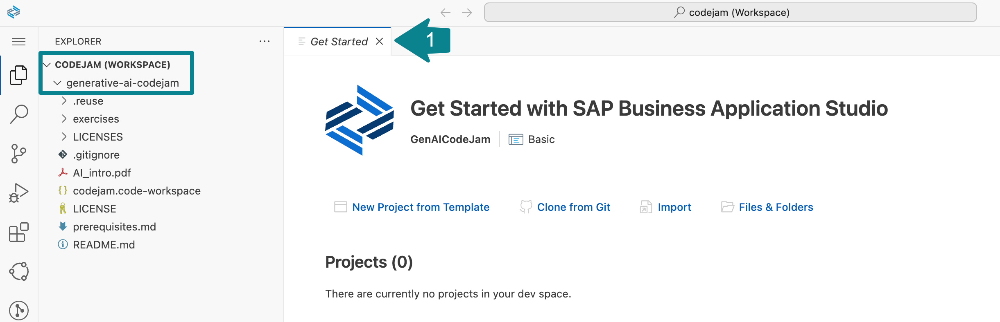

## Configure the connection details to Generative AI Hub

👉 Go back to the Subaccount in the [BTP cockpit](https://emea.cockpit.btp.cloud.sap/cockpit#/globalaccount/275320f9-4c26-4622-8728-b6f5196075f5/subaccount/a5a420d8-58c6-4820-ab11-90c7145da589/subaccountoverview).

👉 Navigate to `Instances and Subscriptions` and open the **SAP AI Core** instance's service binding. This is the service key you need to connect to the SAP AI Core instance.

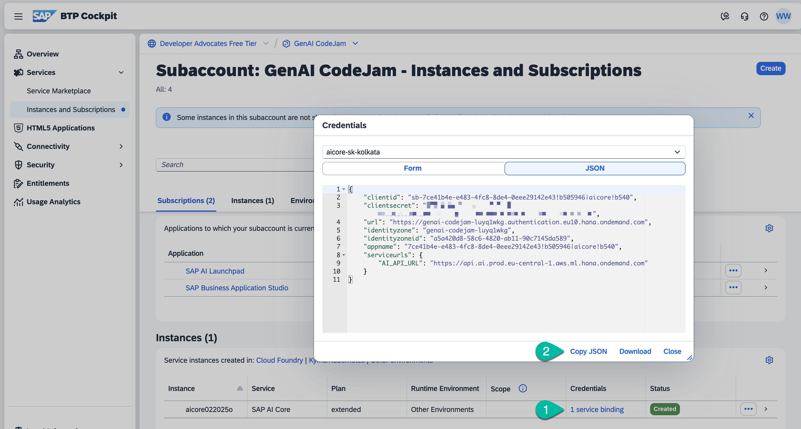

👉 Click **Copy JSON**.

👉 Return to BAS and create a new file `.aicore-config.json` in the `generative-ai-codejam/` directory.

👉 Paste the service key into `generative-ai-codejam/.aicore-config.json`, which should look similar to the following:

```json
{
  "appname": "7ce41b4e-e483-4fc8-8de4-0eee29142e43!b505946|aicore!b540",
  "clientid": "sb-7ce41b4e-e483-4fc8-8de4-0eee29142e43!b505946|aicore!b540",
  "clientsecret": "...",
  "identityzone": "genai-codejam-luyq1wkg",
  "identityzoneid": "a5a420d8-58c6-4820-ab11-90c7145da589",
  "serviceurls": {
    "AI_API_URL": "https://api.ai.prod.eu-central-1.aws.ml.hana.ondemand.com"
  },
  "url": "https://genai-codejam-luyq1wkg.authentication.eu10.hana.ondemand.com"
}
```

This configuration can now be loaded into a Python environment so that the SAP Cloud SDK for AI, which you are going to use later, can connect to SAP AI Core.

## Create a Python virtual environment and install the SAP's [Python SDK for Generative AI Hub](https://pypi.org/project/generative-ai-hub-sdk/)

👉 Start a new Terminal.

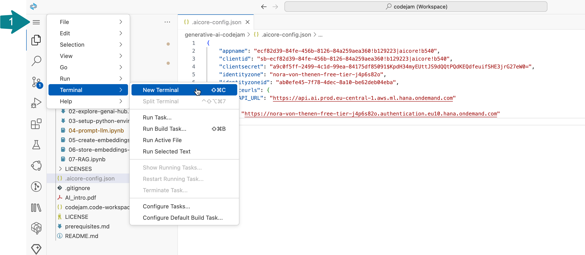

👉 Create a virtual environment using the following command:

```bash
python3 -m venv ~/projects/generative-ai-codejam/env --upgrade-deps
```

👉 Activate the `env` virtual environment like this and make sure it is activated:

```bash
source ~/projects/generative-ai-codejam/env/bin/activate
```

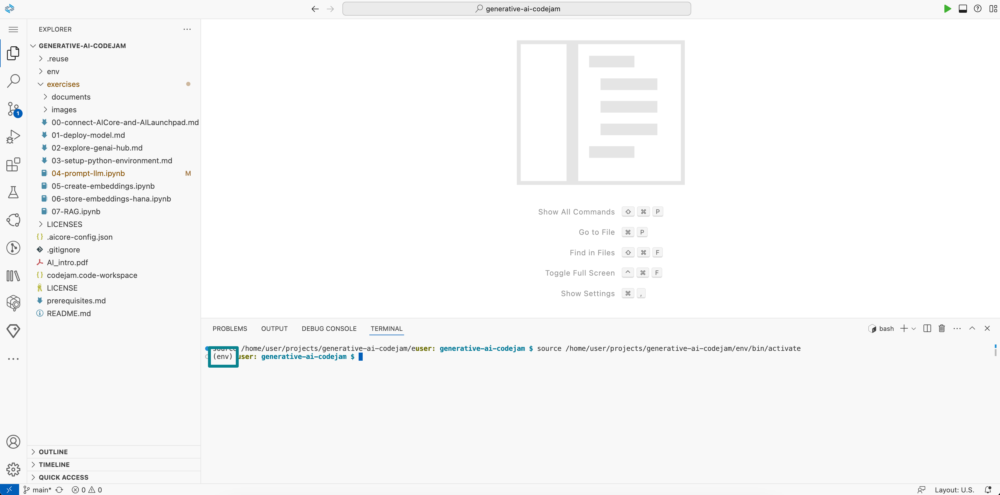

In order to proceed with the implementation, you need to install some required Python packages using the `pip install` command.

The following packages are required:

- [SAP Cloud SDK for AI (Python)](https://pypi.org/project/sap-ai-sdk-gen/)
  > With this SDK you can leverage the power of generative models available in the generative AI Hub of SAP AI Core. The SDK provides model access by wrapping the native SDKs of the model providers (OpenAI, Amazon, Google), through langchain, or through the orchestration service.
- [LangChain integration for SAP HANA Cloud](https://pypi.org/project/langchain-hana/)
  > Integrates LangChain with SAP HANA Cloud to make use of vector search, knowledge graph, and further in-database capabilities as part of LLM-driven applications.
- [scipy 1.17.1](https://pypi.org/project/scipy/)
  > SciPy (pronounced “Sigh Pie”) is an open-source software for mathematics, science, and engineering.
- [pypdf 6.7.5](https://pypi.org/project/pypdf/)
  > pypdf is a free and open-source pure-python PDF library capable of splitting, merging, cropping, and transforming the pages of PDF files.
- [wikipedia 1.4.0](https://pypi.org/project/wikipedia/)
  > Wikipedia is a Python library that makes it easy to access and parse data from Wikipedia.

👉 Execute the following command to install all necessary packages:

```bash
pip install --require-virtualenv -U 'sap-ai-sdk-gen[all]' langchain-hana==0.2.2 scipy "pypdf!=6.6.0" wikipedia
```

## From now on, continue the exercises in BAS

From this point on, you will continue all exercises through writing and executing code from within so called Jupyter Notebooks.
Jupyter Notebooks are widely used in the Data Science space for prototyping, building and testing AI related code.

We have provided you instructions and code stubs through Jupyter Notebooks in all following exercises. Out of that reason, you will continue with the exercises from within BAS.

👉 From within your workspace in BAS open the Jupyter Notebook for Exercise 03.

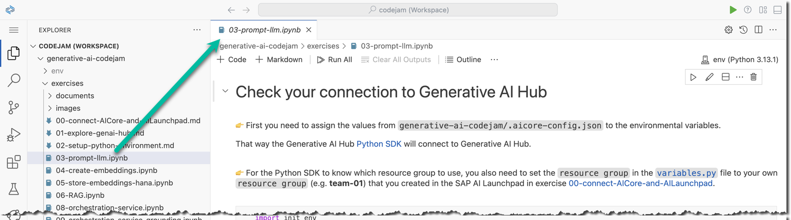

[Next exercise](03-prompt-llm.ipynb)

## (Optional) Python in SAP Business Application Studio

To learn more about using Python in SAP BAS, check out these blog posts on SAP Community:

- [Using Python in SAP Business Application Studio](https://community.sap.com/t5/technology-blog-posts-by-sap/using-python-in-sap-business-application-studio-my-notes/ba-p/14155516)
- [Using Jupyter in SAP Business Application Studio](https://community.sap.com/t5/technology-blog-posts-by-sap/using-jupyter-in-sap-business-application-studio-my-notes/ba-p/14167294)
- [Using conda-forge in SAP Business Application Studio](https://community.sap.com/t5/technology-blog-posts-by-sap/using-conda-forge-in-sap-business-application-studio-my-notes/ba-p/14169956)
