# Setup SAP Business Application Studio and a dev space
> [SAP Business Application Studio](https://help.sap.com/docs/bas/sap-business-application-studio/what-is-sap-business-application-studio) is based on Code-OSS, an open source project used for building Visual Studio Code. Available as a cloud service, SAP Business Application Studio provides a desktop-like experience similar to leading IDEs, with command line and optimized editors.

> At the heart of SAP Business Application Studio are the dev spaces. The dev spaces are comparable to isolated virtual machines in the cloud containing tailored tools and preinstalled runtimes per business scenario, such as SAP Fiori, SAP S/4HANA extensions, Workflow, Mobile and more. This simplifies and speeds up the setup of your development environment, enabling you to efficiently develop, test, build, and run your solutions locally or in the cloud.

## Open SAP Business Application Studio
👉 Go back to your [BTP cockpit](https://emea.cockpit.btp.cloud.sap/cockpit).

👉 Navigate to `Instances and Subscriptions` and open `SAP Business Application Studio`.

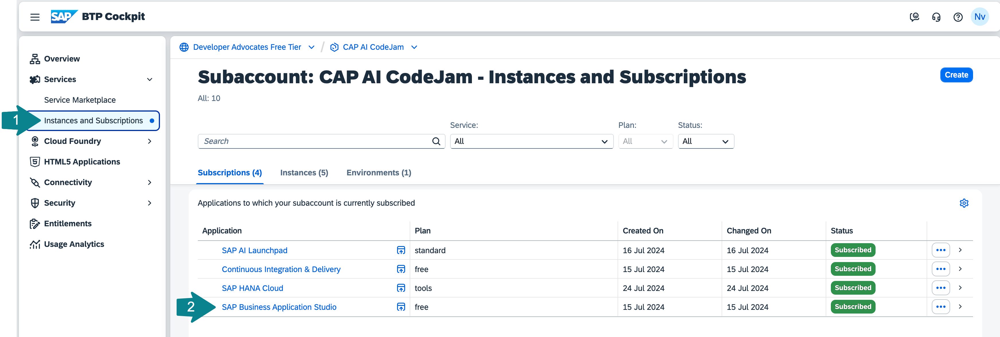


## Create a new Dev Space for CodeJam exercises

👉 Create a new Dev Space.

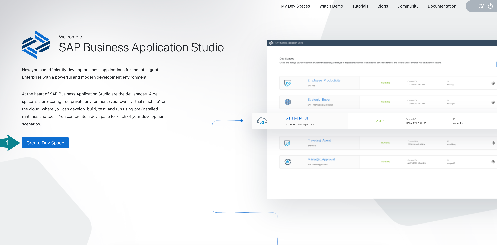

👉 Enter the name of the Dev space `GenAICodeJam`, select the `Basic` kind of application and `Python Tools` from Additional SAP Extensions.

👉 Click **Create Dev Space**.

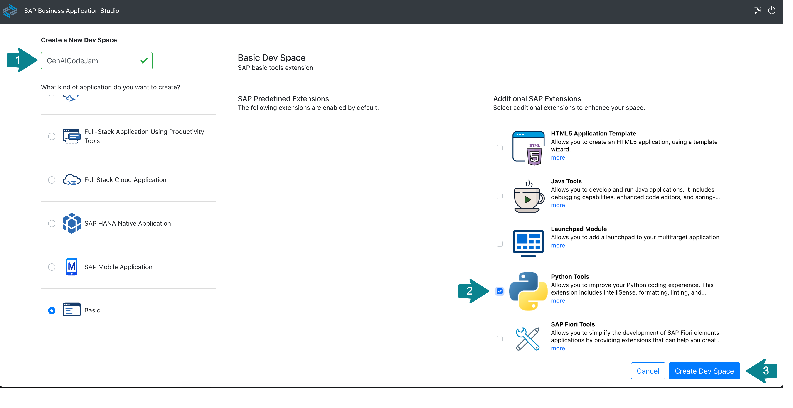

You should see the dev space **STARTING**.

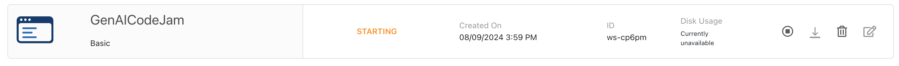

👉 Wait for the dev space to get into the **RUNNING** state and then open it.

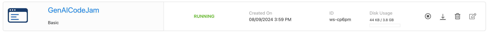

## Clone the exercises from the Git repository

👉 Once you opened your dev space in BAS, use one of the available options to clone this Git repository with exercises using the URL below:

```sh
https://github.com/SAP-samples/generative-ai-codejam.git
```

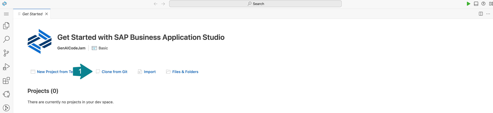

👉 Click **Open** to open a project in the Explorer view.

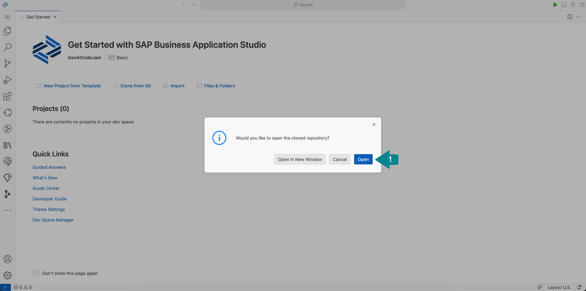

## Open the Workspace

The cloned repository contains a file `codejam.code-workspace` and therefore you will be asked, if you want to open it. 

👉 Click **Open Workspace**.

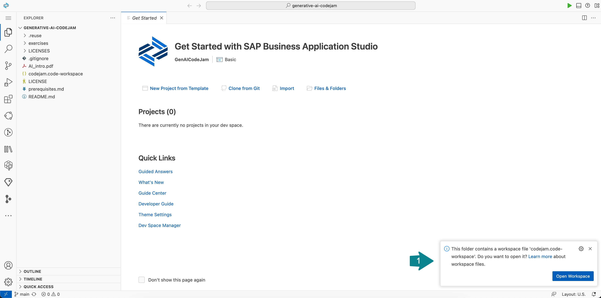

☝️ If you missed the previous dialog, you can go to the BAS Explorer, open the `codejam.code-workspace` file, and click **Open Workspace**.

You should see:
* `CODEJAM` as the workspace at the root of the hierarchy of the project, and
* `generative-ai-codejam` as the name of the top level folder.

👉 You can close the **Get Started** tab.

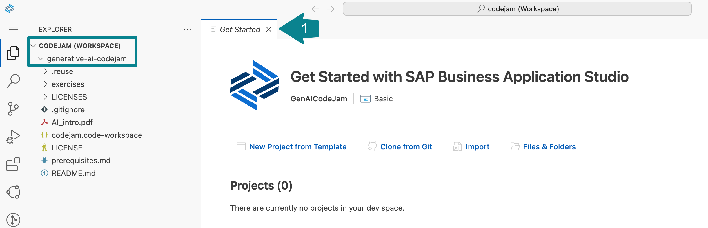

## Configure the connection to Generative AI Hub

👉 Go back to your [BTP cockpit](https://emea.cockpit.btp.cloud.sap/cockpit).

👉 Navigate to `Instances and Subscriptions` and open the SAP AI Core instance's service key.

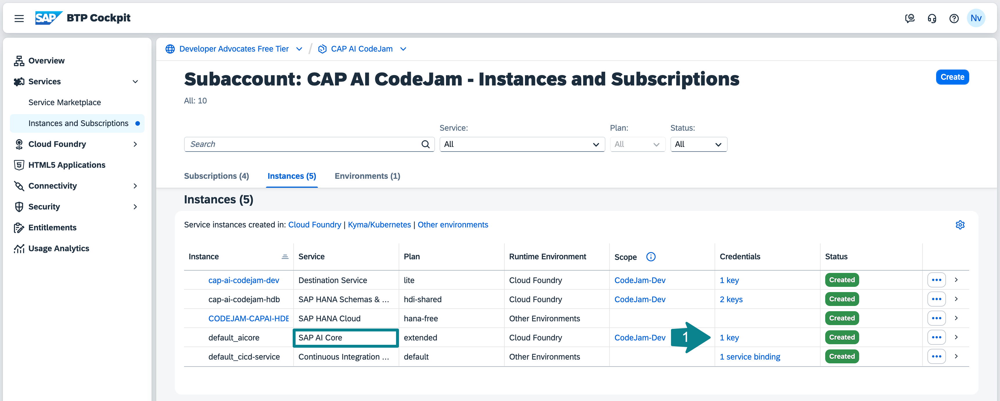

👉 Click **Copy JSON**.

👉 Return to BAS and create a new file `.aicore-config.json` in the `generative-ai-codejam/` directory.

👉 Paste the service key into `generative-ai-codejam/.aicore-config.json`, which should look similar to the following.

```json
{
    "serviceurls": {
      "AI_API_URL": "https://api.ai.prod.us-east-1.aws.ml.hana.ondemand.com"
    },
    "appname": "e9ff8604-ba8e-4322-91e4-c5550722de44!b305299|aicore!b164",
    "clientid": "sb-e9ff8604-ba8e-4322-91e4-c5550722de44!b305299|aicore!b164",
    "clientsecret": "",
    "identityzone": "cap-ai-codejam-op6zhda1",
    "identityzoneid": "6088766d-dcc4-4e56-972f-652baad796be",
    "url": "https://cap-ai-codejam-op6zhda1.authentication.us10.hana.ondemand.com"
  }
```

## Create a virtual environment and install the Python SDK for Generative AI Hub

👉 Start a new Terminal.

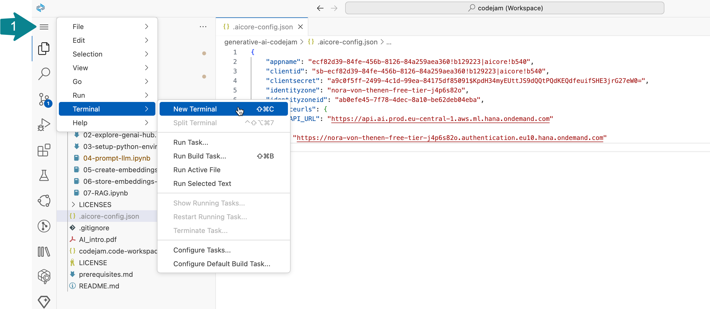

👉 Create a virtual environment using the following command:

```bash
python3 -m venv ~/projects/generative-ai-codejam/env --upgrade-deps
```

👉 Activate the `env` virtual environment like this and make sure it is activated:

```bash
source ~/projects/generative-ai-codejam/env/bin/activate
```

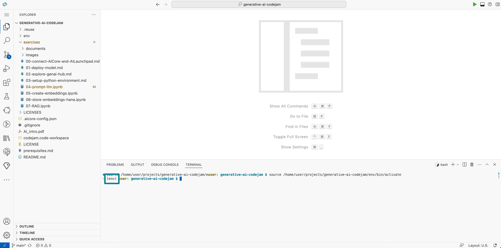

👉 Install the Generative AI Hub [Python SDK](https://pypi.org/project/generative-ai-hub-sdk/) (and the other packages listed below) using the following `pip install` commands.

```bash
pip install --require-virtualenv generative-ai-hub-sdk[all]
```

👉 We will also need the [HANA client for Python](https://pypi.org/project/hdbcli/).

```bash
pip install --require-virtualenv hdbcli
```

👉 We will also need the [SciPy package](https://pypi.org/project/scipy/).

```bash
pip install --require-virtualenv scipy
```

👉 We will also need the [pydf package](https://pypi.org/project/pypdf/).

```bash
pip install --require-virtualenv pypdf
```

👉 And [LangChain Experimental](https://pypi.org/project/langchain-experimental/).

```bash
pip install --require-virtualenv generative-ai-hub-sdk[all] langchain-experimental
```

> From now on the exercises continue in BAS.

[Next exercise](04-prompt-llm.ipynb)
