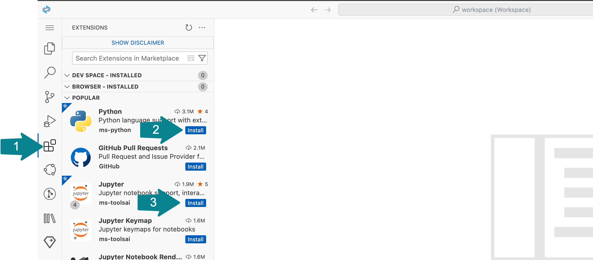

# Setup SAP Business Application Studio and a dev space

## Use SAP Business Technology Platform
It is assumed that you have access to the SAP Business Technology Platform - either via your organization or via a free trial, as described in [prerequisites](../prerequisites.md).

👉 If you are using SAP BTP Trial, then open it: https://hanatrial.ondemand.com/

## Open SAP Business Application Studio
👉 If you are using the [SAP BTP free trial](https://account.hanatrial.ondemand.com/trial/#/home/trial), then open [SAP Business Application Studio trial](https://triallink.us10.trial.applicationstudio.cloud.sap/) from the "Quick Tool Access" section.


Should you have issues opening SAP Business Application Studio (for example when you have had the account for a long time), then check the steps in [this tutorial - Set Up SAP Business Application Studio for Development](https://developers.sap.com/tutorials/appstudio-onboarding.html)

## Create a new Dev Space for CodeJam exercises

👉 Go to your instance of SAP Business Application Studio (BAS).

👉 For this SAP CodeJam exercise create a new Dev Space called `genAICodeJam` of kind **Basic** with an additional extension **Python Tools** in BAS:

|Screen element|Value|
|-|-|
|Dev Space name|`genAICodeJam`|
|Kind|**Basic**|
|Additional extension|**Python Tools**|


You should see the dev space **STARTING**.


👉 Wait for the dev space to get into the **RUNNING** state and then open that dev space.


## Clone the exercises from the Git repository

👉 Once you opened your dev space in BAS, use one of the available options to clone this Git repository with exercises using the URL below: 
```sh
https://github.com/SAP-samples/generative-ai-codejam.git
```


👉 Click **Open** to open a project in the Explorer view.


## Open the Workspace

The cloned repository contains a file `codejam.code-workspace` and therefore you will be asked, if you want to open it. 

👉 Click **Open Workspace**.


☝️ If you missed the previous dialog, you can go to the BAS Explorer, open the `codejam.code-workspace` file, and click **Open Workspace**.

You should see:
* **CODEJAM** as the workspace at the root of the hierarchy of the project, and
* **`generative-ai-codejam`** as the name of the top level folder.


## Check that the required extensions are installed

👉 Go to **Extensions** using the activity bar (the left-most bar in the IDE) and check whether **Python** and **Jupyter** extensions are installed already.

👉 If they are not installed, install them now.

