# Orchestration Service in SAP AI Launchpad
The orchestration service of Generative AI Hub lets you use all the available models with the same codebase. You only deploy the orchestration service and then you can access all available models simply by changing the model name parameter. You can also use grounding, prompt templating, data masking and content filtering capabilities.

This YouTube video ([AI Foundation: Orchestration workflow with grounding using S3](https://youtu.be/f2hgGgpLIn0)) shows the steps of the following exercise.

👉 Open **[SAP AI Launchpad](https://genai-codejam-luyq1wkg.ai-launchpad.prod.eu-central-1.aws.ai-prod.cloud.sap/aic/index.html#/workspaces&/a/detail/TwoColumnsMidExpanded/?workspace=ai-codejam&resourceGroup=s3-grounding)**

## [1/3] Select `s3-grounding` Resource Group
👉 Go to **Workspaces** and select the `s3-grounding` resource group.

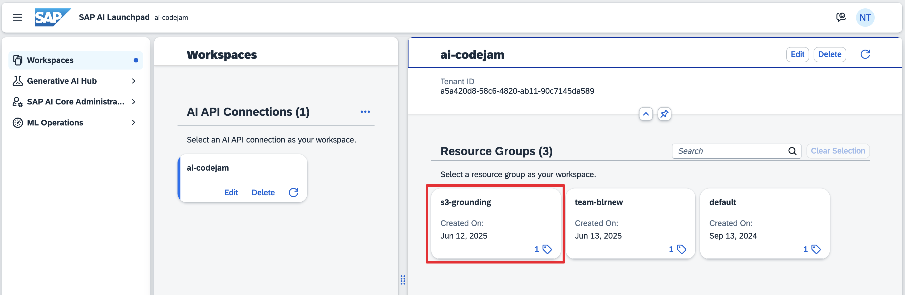

## [2/3] Create Grounding Pipeline

👉 Go to **SAP AI Core Administration > Generic Secrets** and check whether an S3 bucket is added. DO NOT DELETE IT!

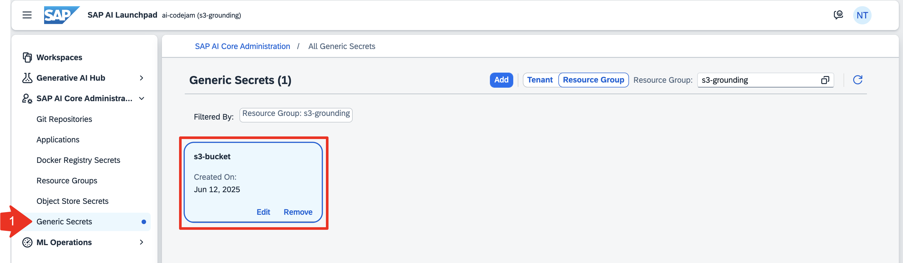

👉 Go to **Generative AI Hub > Grounding Management**.

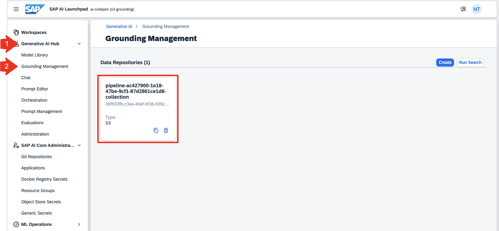

👉 Select the available pipeline and have a look at the documents, chunks and metadata.

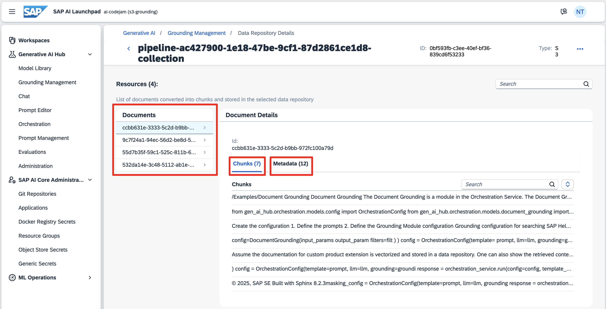

👉 Select the three dots in the top right corner and click **Run Search**.

👉 Type the question you want to ask to see which chunk would be retrieved. This is not a RAG pipeline yet, so there is no model to answer your question. This is simply to check which chunks would be retrieved for your use case.

👉 Select your pipeline and run the search.

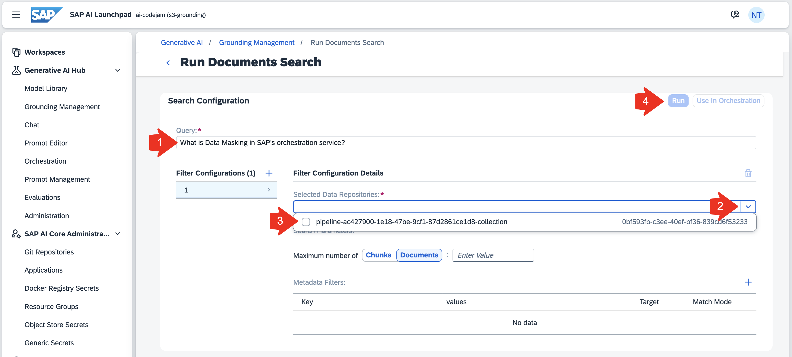

## [3/3] Build an Orchestration Workflow with your Grounding Pipeline

👉 Go to **Orchestration**. At the top you now see the different modules of the orchestration service. First configure the **Grounding** module as instructed below.

👉 The Input variable will hold your user input, question or query.

👉 The Output variable will hold the text chunk(s) that are retrieved from your grounding pipeline.

👉 Select your pipeline and go to **Templating**.

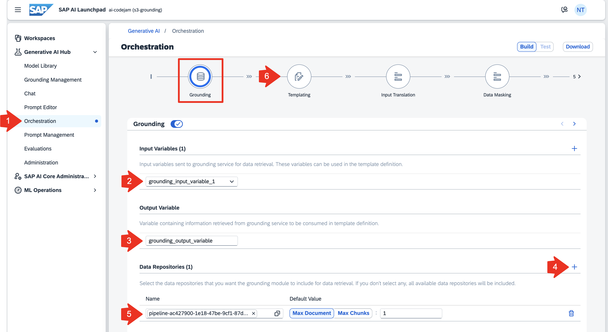

👉 Add the input variable `grounding_input_variable_1` from the previous step to the template.

👉 Finalize your prompt template by specifying question and context. Add any other information that could be helpful for the LLM and your use case.

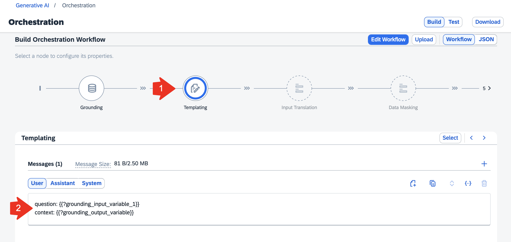

👉 Make sure to either configure all of the other modules or turn them off. You can add **Input/Output Translation**, **Data Masking**, **Input/Output Filtering**

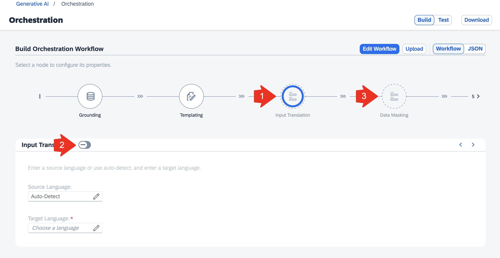

👉 You need to select a model you want to use under **Model Configuration**.

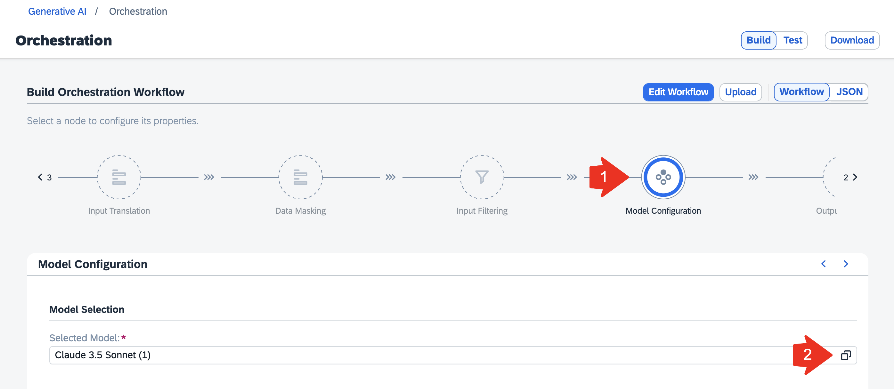

👉 Once all of the modules are configured or disabled you can **Test** the workflow.

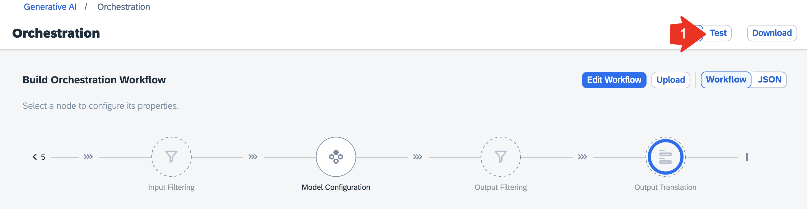

👉 Add your question and run the orchestration workflow. Also check the **Trace** to understand more about your query. You just build the same RAG (retrieval-augmented generation) use case as in exercise [06-RAG](06-RAG.ipynb).

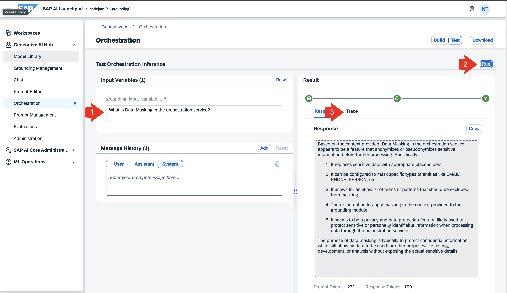

> 👉 For the next exercises go to **Workspaces** and select your own resource groups again!

[Next Exercise](08-orchestration-service.ipynb)
